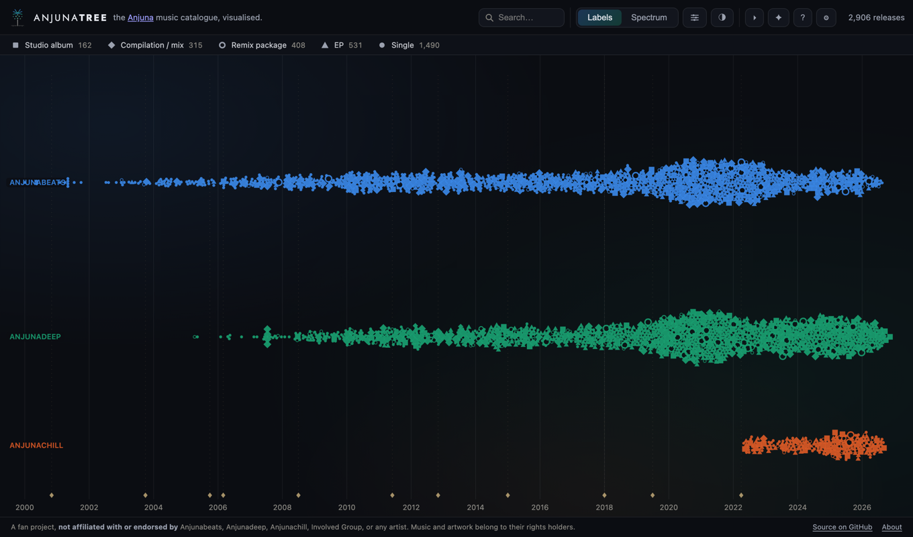
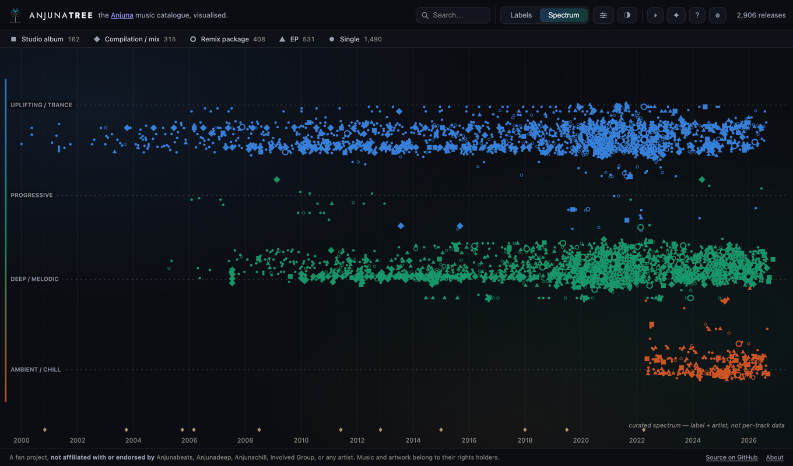
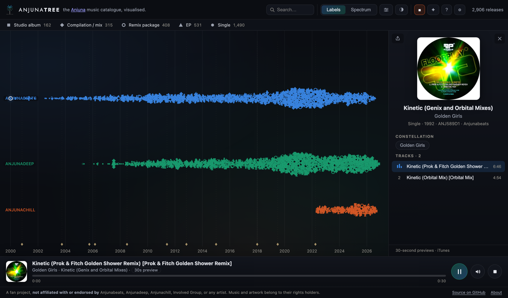
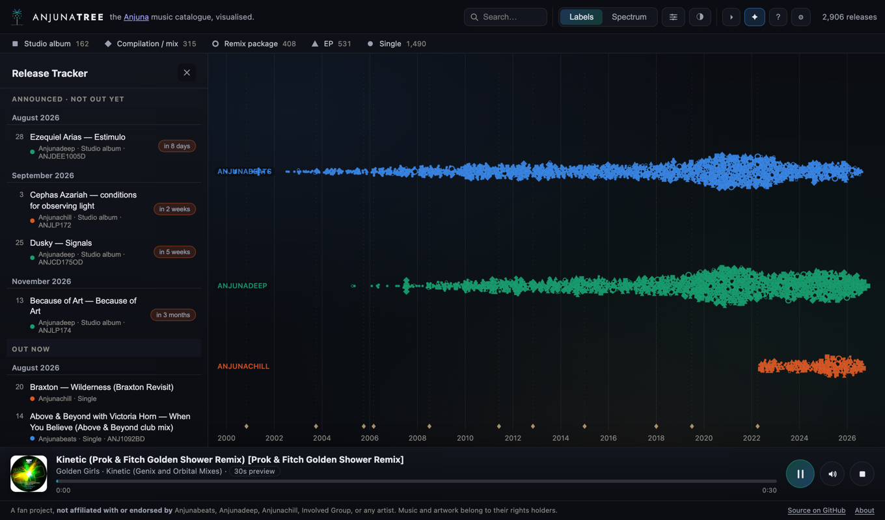

<picture>
  <source media="(prefers-color-scheme: dark)" srcset="docs/hero-dark.svg">
  
</picture>

**→ [anjunatree.com](https://anjunatree.com)**

An interactive map of the Anjunabeats / Anjunadeep / Anjunachill catalogue —
every release since 2000 plotted on a zoomable timeline, with 30-second
previews on click. An unaffiliated, non-commercial fan project. Not
associated with or endorsed by Anjunabeats, Anjunadeep, Anjunachill, Involved
Group, or any artist.

## What it does

Two views: **Labels** (one lane per label) and **Spectrum** (releases
arranged along a curated trance → ambient genre axis), with an animated
transition between them. Release types are encoded as shapes — square =
studio album, diamond = compilation/mix (the *Volumes*), ring = remix
package, triangle = EP, circle = single — with a legend that recomputes
against the active filters.

 

### Surprise Me

Press play and it walks the map for you, one preview at a time —
chronologically, or through the constellation you're currently viewing.
Click any release and every other release by that artist lights up,
connected chronologically across the whole catalogue, so you can follow one
artist's arc across labels and years.

### Release Tracker

A changelog-style feed of what's just come out and what's announced but not
released yet, with a running countdown ("in 8 days", "in 3 weeks") on
anything still to come.

### Everything else

- **Listen instantly** — every release plays a 30-second iTunes preview, no
  account needed. Connect Spotify Premium and the same releases play in
  full.
- **Shareable links** — the URL always encodes your view, search, filters,
  and selection, so any moment on the map is a link you can send someone;
  a share button copies it, and the map can be exported as a PNG.
- **Make it yours** — connect Spotify and, if you turn it on, your saved
  albums and tracks get rung on the map; any artist's constellation can be
  exported as a private Spotify playlist.
- **Themes & accessibility** — four themes named after the music, four text
  sizes, high contrast, larger map marks, and reduced motion.
- **Installable** — add it to your home screen and the whole map works
  offline.

## Credits

AnjunaTree is built almost entirely on other people's work. In rough order of
how load-bearing they are:

- **[MusicBrainz](https://musicbrainz.org)** — the entire catalogue (every
  release, artist, and date) is community-maintained data from MusicBrainz,
  used under [CC0](https://musicbrainz.org/doc/About/Data_License). Without
  it there's no map.
- **[Apple's iTunes Search API](https://developer.apple.com/library/archive/documentation/AudioVideo/Conceptual/iTuneSearchAPI/)**
  — every 30-second preview and piece of artwork is served live by Apple,
  not stored or proxied here.
- **[Spotify Web Playback SDK](https://developer.spotify.com/documentation/web-playback-sdk)**
  — powers the optional full-track tier for Premium listeners who connect
  their account.
- **[React](https://react.dev)**, **[D3](https://d3js.org)** (the canvas
  layout, zoom, and force simulation), **[Vite](https://vitejs.dev)**, and
  **[vite-plugin-pwa](https://vite-pwa-org.netlify.app)** — the app itself is
  built on these.
- **[Jost](https://github.com/indestructible-type/Jost)** — the wordmark's
  typeface, [SIL Open Font License](https://github.com/indestructible-type/Jost/blob/master/OFL.txt),
  self-hosted rather than loaded from a CDN.
- **[Umami](https://umami.is)** — the optional, self-hosted, cookie-free
  analytics some deployments use; off unless a maintainer configures it (see
  [docs/DEVELOPMENT.md](docs/DEVELOPMENT.md)).

The full, versioned list of every package this project depends on is
`package.json` / `package-lock.json` — nothing here is hidden or vendored in
without attribution. If you notice a credit that's missing or wrong,
[open an issue](https://github.com/afterglowfc/anjunatree/issues/new).

## Contributing

Issues, ideas, and corrections are welcome — see
**[CONTRIBUTING.md](CONTRIBUTING.md)** for where things live and how to send a
patch.

## Development

Want to run it locally, refresh the catalogue, connect Spotify/Apple Music,
or deploy your own copy? See **[docs/DEVELOPMENT.md](docs/DEVELOPMENT.md)**.

## License

[MIT](LICENSE) © Tyler Meuse.
